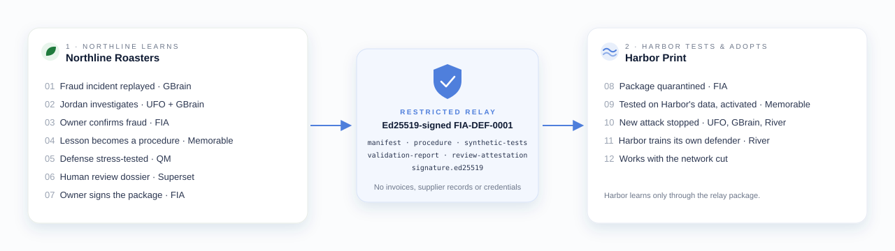

# FIA — Fraud Intelligence Agency

FIA, the **Fraud Intelligence Agency**, is a fraud intelligence network owned by the businesses using it. Its principle is simple: **share the lesson, keep the ledger.**

Each business controls its own workspace, employee agents, private memory, and operational decisions. When one business discovers a fraud pattern, it can publish a reviewed investigation procedure, synthetic examples, and measured test results without sharing its invoices, supplier records, or private conversations. Other businesses evaluate that intelligence against their own policies before adopting it.

Our demonstration follows two fictional businesses. Northline Roasters investigates a supplier payment scam and develops a reusable defense. Harbor Print receives that defense and applies it to a different suspicious request using Harbor’s own records. Harbor can contribute reviewed improvements back to the network, allowing the shared intelligence to evolve while each business retains independent control.

## How the sponsors fit

**Each sponsor powers a specific part of this learning and execution loop.**

**GBrain provides private business memory.** Each company has a separate instance containing supplier history, approved contacts, payment policies, incident evidence, and defense provenance. Agents retrieve context from their own company’s knowledge. FIA enforces workspace access boundaries and controls which intelligence can be published.

**UFO runs investigations and business workflows.** FIA extends its agent runtime with tools for retrieving evidence, recording assessments, drafting verification requests, and placing simulated payments on hold after authorization. UFO coordinates execution, while FIA supplies the fraud investigation tools and approval rules.

**Memorable turns experience into reusable procedures.** Its extraction API receives an approved synthetic investigation trace and produces a draft procedure. FIA reviews and evaluates that procedure before sharing it. Once a recipient accepts the defense, Memorable makes it recallable during future investigations. This improves procedural memory without requiring a model update.

**QM powers defense evaluation.** FIA’s QM extension coordinates workers that test candidate procedures against synthetic fraud attempts and legitimate requests. QM provides execution sessions and run records. FIA supplies the scenarios, fixed scoring logic, unseen test cases, and acceptance criteria. Both publishers and recipients use the resulting evidence to decide whether to adopt a defense.

**River AI enables model adaptation.** Approved synthetic examples and corrected investigation trajectories become training data for a candidate LoRA adapter. FIA evaluates the adapter against the same base model to determine whether training adds value beyond procedural memory. Independent deployment requires the exported adapter, its corresponding base model, and a verified compatible local runtime.

**Superset supports development and human review.** Superset is the development environment, while Pages presents sanitized defense proposals, evaluation reports, and the demonstration for review and revision. FIA retains responsibility for publication authorization, recipient activation, and payment approvals. Superset is not a dependency of the intended offline defender.

The demo uses synthetic records and simulated payments, with synthetic inputs for cloud extraction and training. The ownership goal is independently runnable intelligence: businesses retain their memory, accepted procedures, and model adaptations rather than depending permanently on the service that helped create them.

**FIA turns one business’s experience into a defense others can inspect, test, improve, and keep.**

> The overview above describes the full design. What the current build actually ran is listed in [Current status](#current-status-what-ran-vs-reduced).

---

## The workflow



One end-to-end workflow, twelve stages, defined in [`packages/contracts/workflow.ts`](packages/contracts/workflow.ts). Each stage is run by `POST /api/workflow/<stageId>/run` on the owning workspace, is gated on its prerequisites server-side, and records its status, receipts, and per-agent sponsor usage.

| # | Stage id | Workspace | What happens | Sponsors |
|---|---|---|---|---|
| 1 | `incident_replay` | Northline | Fraud incident replayed | GBrain |
| 2 | `investigation` | Northline | Jordan investigates | UFO, GBrain |
| 3 | `confirmation` | Northline | Owner confirms fraud | FIA |
| 4 | `extraction` | Northline | Lesson becomes a procedure | Memorable |
| 5 | `evaluation` | Northline | Agents stress-test the defense | QM |
| 6 | `review` | Northline | Human review dossier | Superset |
| 7 | `publication` | Northline | Signed defense published | FIA |
| 8 | `import_quarantine` | Harbor | Package quarantined | FIA |
| 9 | `acceptance` | Harbor | Harbor tests and activates | Memorable, FIA |
| 10 | `harbor_investigation` | Harbor | Harbor's defender stops a new attack | UFO, GBrain, Memorable, River |
| 11 | `training` | Harbor | Harbor trains its own defender | River |
| 12 | `offline_proof` | Harbor | Works with the network cut | GBrain, Memorable, River |

Stage status is one of `not_run`, `running`, `done`, `blocked`, `failed`, `reduced`. Agents never approve, publish, or release payments: owner actions are separate requests with `{"approve": true}`.

## Architecture

| Service | Port | Code |
|---|---|---|
| Console (presenter UI, proxies `/ws/<ws>/api/*`, demo at `/demo`) | `:7100` | `apps/console/` |
| Northline workspace | `:7101` | `apps/workspace/` with `WORKSPACE=northline` |
| Harbor workspace | `:7102` | `apps/workspace/` with `WORKSPACE=harbor` |
| Restricted relay | `:7103` | `apps/relay/` |
| River inference shim (Python, `river-client`) | `:7110` | `integrations/river/` |
| QM core (separate local checkout in `qm/`, not committed) | `:8081` | `integrations/probes.ts` |

**Isolation.** Each workspace has its own SQLite store under `data/<ws>/`, its own owner token, and one private, keyless GBrain (`gbrain init --pglite --no-embedding`) at `data/<ws>/gbrain`, reached by Maya over MCP stdio (`gbrain serve --surface verbs`). Northline and Harbor never read each other's data; Harbor learns only through the relay package. [`acceptance/isolation.test.ts`](acceptance/isolation.test.ts) checks this against the running stack.

**Employee agents.** Maya (private memory, GBrain), Jordan (investigation, UFO tools), Lena (verification drafts, simulated payment holds), Chris (invoice reconciliation, review dossier).

**Defense package.** A published defense is a directory with exactly six allowlisted files, signed with Ed25519 ([`packages/publication/`](packages/publication/)):

```text
FIA-DEF-0001/1.0.0/
  manifest.json               # identity, applicability, policy bindings, recipient scope
  procedure.json              # reviewed declarative steps and postconditions
  synthetic-tests.jsonl       # approved illustrative/regression cases, never final hidden tests
  validation-report.json      # observed results, versions, case counts, limitations
  review-attestation.json     # sanitized reviewed version/hash reference
  signature.ed25519           # binds payload digest and exact review-attestation bytes
```

The payload digest covers the canonical manifest, which lists the SHA-256 of each payload file. The signature binds that digest and the exact review-attestation bytes. Recipients reject unsigned or tampered packages, unknown files, executable or archived payloads, and untrusted publisher keys. Publisher keys are pinned out of band in `fixtures/network-keys.json`.

**Demo.** `http://127.0.0.1:7100/demo` walks through six scenes: *The network*, *Suspicious payment*, *Share the lesson*, *Harbor receives*, *A new attack*, *Disconnected*.

## Sponsors in the code

| Sponsor | Role | Where in code | Status in this build |
|---|---|---|---|
| GBrain | Private memory, one brain per workspace | `integrations/gbrain/`, `apps/workspace/maya.ts` | Real |
| Memorable | Procedure extraction, local store and recall | `integrations/memorable/`, `apps/workspace/routes/30-procedures.ts` | Real |
| Superset | Pages review dossier | `apps/workspace/routes/60-review.ts` | Real |
| QM | Defense evaluation | `apps/workspace/routes/50-evaluation.ts`, `packages/evaluator/` | Reduced (swarm not run) |
| UFO | Investigation tools and workflow | `integrations/ufo/`, `apps/workspace/routes/20-investigation.ts` | Reduced (River-hosted defender with the same tools) |
| River | Model inference; LoRA training pipeline | `integrations/river/`, `apps/workspace/routes/70-training.ts` | Inference real; training not run |

## Current status (what ran vs. reduced)

Per spec rule HONEST-01, this build makes no claim of money saved, privacy certification, or generalization to unseen attack classes. In the recorded demo:

- **GBrain: real.** Separate keyless brains per workspace; evidence is returned as facts with IDs and provenance.
- **Memorable: real.** A real `/v1/extract` call produced the draft procedure (request `b47b61df-0108-47ce-8f6d-7afc62e341c4`). Harbor stores and recalls the accepted procedure in its own local Memorable store.
- **Superset: real.** The review dossier was published as a Superset Page.
- **Signing and relay: real.** Ed25519 signatures, pinned keys, and tamper tests.
- **QM: reduced.** Evaluation ran with FIA's fixed scorer on 12 validation cases via River: 12/12, against a 12/12 baseline, so **no gain is claimed**. The QM swarm itself did not run; it needs QM source-auth credentials.
- **UFO: reduced.** The hosted client was not signed in, so investigations ran as a River-hosted defender using the same bounded FIA tools. A self-hosted `ufo-core` was verified against River but not wired in.
- **River: inference real, training not run.** All model inference used River (`Qwen/Qwen3.5-9B`). The LoRA training pipeline is built but was not run; no adapter was exported or loaded, so there is no "River-trained" claim.
- **Offline proof: reduced.** Egress was blocked with `sandbox-exec` (loopback only), and retrieval, procedure recall, and the payment hold were verified offline. Model inference still goes to River's cloud, so this is not a fully offline defender.

All data is synthetic and all payments are simulated. FIA is a hackathon prototype, not a certified compliance or fraud-prevention system.

## Repository layout

```text
apps/
  console/          presenter UI and /demo (port 7100)
  workspace/        per-business workspace server; stage routes in routes/NN-*.ts
  relay/            restricted package relay (port 7103)
packages/
  contracts/        workflow stages and shared types
  publication/      package schema, Ed25519 signing/verification, key provisioning
  evaluator/        fixed scorer and validation/final labels
  simulator/        synthetic fixture generator and SQLite store
integrations/
  gbrain/           GBrain MCP knowledge store
  memorable/        extraction client and local store
  river/            River inference shim, training sidecar
  ufo/              investigation tools and defender runner
  probes.ts         sponsor health probes
acceptance/         isolation test against the running stack
scripts/            dev launcher, demo reset
fixtures/           generated synthetic companies and pinned public keys
docs/               build brief, sponsor notes, screen-to-sponsor map
spec.md             authoritative product and security spec
```

## Getting started

Requirements: Node 24+, [Bun](https://bun.sh), [uv](https://docs.astral.sh/uv/) (for the River shim), macOS for the `sandbox-exec` offline check.

```sh
# 1. GBrain (the npm package named "gbrain" is unrelated; do not install it)
bun install -g github:garrytan/gbrain#latest-stable

# 2. Dependencies
npm install

# 3. Keys: create .env in the repo root (never commit it)
#    MEMORABLE_API_KEY=...
#    RIVER_API_KEY=...
#    Superset review uses `superset auth login`.

# 4. Generate and pin the Ed25519 publisher keys and relay tokens
node packages/publication/provision.ts

# 5. Start the River inference shim (port 7110)
integrations/river/serve.sh

# 6. In another terminal, start console, workspaces, and relay
npm run dev

# 7. Open the demo
open http://127.0.0.1:7100/demo
```

`npm run dev` generates synthetic fixtures on first run (`npm run fixtures` does it explicitly).

Reset the demo to "Northline done through publication, Harbor fresh" (stop `npm run dev` first; needs a local `demo-snapshot/`, which is not committed):

```sh
sh scripts/reset-demo.sh
```

Tests:

```sh
node --test packages/publication/verify.test.ts   # signing, tamper and layout rejection
node --test acceptance/isolation.test.ts          # needs the stack running
```

## Further reading

- [`spec.md`](spec.md): product decisions, invariants, package format, evaluation, and fallback policy
- [`docs/sponsor-integrations.md`](docs/sponsor-integrations.md): sponsor APIs as used here
- [`docs/sponsor-map.md`](docs/sponsor-map.md): which service backs each screen element
